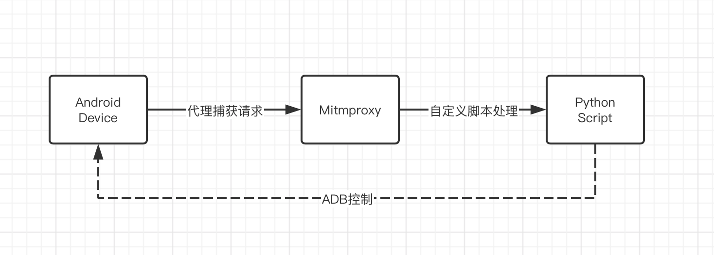

# 自动爬取抖音视频
自动爬取抖音视频并将结果保存在本地。使用ADB控制手机自动上划拉取视频所以适用安卓设备。

参考下面的说明完成操作，即可开始爬取

### 实现过程

> 需求： 
>
> 1. 爬取视频文件并保存在本地
>
>  	2. 视频无水印
>  	3. 实现自动上划/左右划来加载新的视频并触发爬取

目前短视频平台的实现方式一般是在请求返回的数据中加入视频地址，再请求视频地址获取对应视频并播放。

​		如果我们想要自动爬取视频并保存视频文件到电脑当中则需要获取到每次拉取的视频地址并请求文件保存在本地，为了实现这个目的我们用电脑代理手机的网络请求，这样就能获取响应内容进而解析出视频地址。

​		此时我们就需要一个代理软件，大家常用的比如`Charles,Fiddler`等，但是这些软件无法通过简单的方式和我们的Python程序进行联动，所以此处我们选择[Mitmproxy](https://mitmproxy.org/)这个代理，具体介绍大家请参照官网。



### 使用前准备：

> 开始前请注意以下几点：
>
> * 手机抓包需要在手机端安装代理的证书，这样才能抓取Https报文。从**Android 7**开始，系统层面对用户安装的证书做了限制，直接安装后仍无法抓取Https，处理起来比较麻烦。
>
>  所以此处强烈建议使用**Android 6**系统操作，**Android 6**！！，**Android 6**！！，**Android 6！！**
>
> * 视频文件保存地址可在`resource/XXX.config`中修改
>
> * Python 3.X 环境，建议使用Virtualenv创建

1. 手机USB调试打开且连接正常
2. 电脑端ADB命令正常使用
3. 安装项目需要的依赖：`pip install -r requirements.txt`
4. 确保电脑`8080`端口可用，此端口为`Mitmproxy`默认代理端口，如有需要可通过命令修改，详情参照官方文档
5. 连接WIFI并保证与电脑在同一局域网，手机端 [设置代理](https://gfw.press/blog/?p=68)

### 开始抓取

#### 1. 使用我们定义的抓取脚本启动Mitmproxy代理

Mitmproxy提供3中启动方式，详情参照[官方文档](https://docs.mitmproxy.org/stable/),此处我们选择[**mitmweb**](https://docs.mitmproxy.org/stable/tools-mitmweb/)方式，方便观察报文内容

项目根目录运行：	

```shell
mitmweb -s Launcher.py
```

此时打开Mitmproxy的Web管理界面即可看到当前抓取内容，默认为http://localhost:8081

#### 2. 手机安装代理证书，打开软件

手机安装Mitmproxy证书。在手机端访问：http://mitm.it  选择安卓下载证书，将证书安装完成即可,[参考](https://jingyan.baidu.com/article/3c343ff7bb2a5a0d377963b3.html)

安装完成后在**Mitmweb**中即可看到收发的网络请求

一切正常后手机端启动短视频软件，即可开始爬取

#### 3. 启动自动滑动脚本，开始自动爬取

在项目`adb/`下，启动自动滑动脚本

```shell
python AutoSlide.py
```

### 功能延伸

* 根据不同视屏平台的返回数据格式，可添加不同的解析程序，参考`resource/douyin_config.py`，可自行添加其他视频平台
* 视频平台返回的播放地址如果有两个，一般是有水印和无水印各一版，根据自己的需求选择无水印的连接爬取即可
* 可自己扩展将爬取结果写入数据库等需求，在流程中添加对应的处理脚本即可